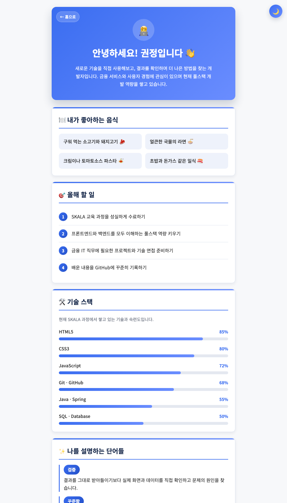
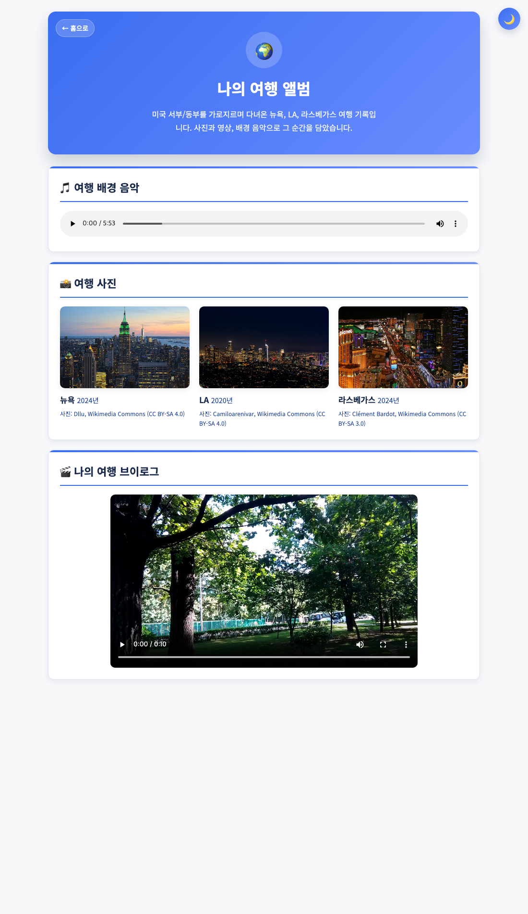

# SKALA-FRONT

SKALA Full-Stack Engineering 과정의 **HTML / CSS / JavaScript** 종합 실습 프로젝트입니다.
개인 포털(Hub) 사이트를 바닐라 웹 기술만으로 구현하며, 시맨틱 마크업·반응형 CSS·비동기 통신·ES 모듈부터 실시간 위치·일정 연동까지 단계적으로 완성했습니다. (프레임워크·UI 라이브러리 미사용)

## 📸 미리보기

| 메인 (라이트) | 메인 (다크) |
| --- | --- |
|  |  |

| 프로필 (스킬 게이지) | 여행 앨범 |
| --- | --- |
|  |  |

| 회원가입 폼 | 강의 일정표 (오늘 강조) |
| --- | --- |
|  |  |

## ✨ 주요 기능

### 메인 허브 (index.html)
- **좌우 스플릿 hero** — 시간대별 인사말, 실시간 시계·날짜, 방문 정보(방문 횟수·지난 방문)
- **오늘의 주요 소식** — 날짜 중심 changelog 스타일 피드
- **이달의 베스트 컷** — 자동 슬라이드 캐러셀(호버 시 정지, 점 인디케이터 동기화)
- **오늘 일정** — 강의 시간표(`myClass.html`)를 `fetch`/파싱해 오늘 일정을 타임라인으로 표시. 진행 중인 일정 강조(NOW), 활동별 아이콘, 지난 일정 흐림 처리
- **요약 스트립 / 바로가기 카드** — 페이지 요소 수를 세어 동적으로 표기

### 실시간 정보 (Open-Meteo + Geolocation)
- **실시간 세계 날씨** — 도시별 현재 기온·습도, WMO 코드 기반 날씨 아이콘·상태 배너(낮/밤·날씨별 그라데이션)
- **실시간 세계 시각** — `Intl.DateTimeFormat`으로 도시 시간대의 현지 시각을 실시간 갱신
- **📍 내 위치** — 브라우저 Geolocation + BigDataCloud 역지오코딩으로 현재 지역 표시 및 내 위치 날씨 조회

### 회원가입 폼 (signUp.html)
- 아이디·비밀번호·이름·이메일 **실시간 유효성 검사**(입력창 내 ✓/✗ 상태 아이콘)
- **비밀번호 강도 미터**(약함~매우 강함), 비밀번호 표시 토글, 이메일 도메인 직접 입력, 자기소개 글자 수 카운터

### 그 외
- **다크모드 토글** — `localStorage` 저장으로 페이지 이동·새로고침에도 유지(FOUC 방지)
- **여행 앨범** — 사진 라이트박스(키보드 ←/→/Esc, 포커스 트랩), 배경 음악·브이로그
- **프로필 스킬 게이지** — 화면 진입 시 채워지는 숙련도 바
- **강의 일정표** — `rowspan`/`colspan` 주간 시간표, 오늘 요일 열 자동 강조, 모바일 가로 스크롤
- **미니 게임 3종** — 업다운, 성적 계산기, 내 가방 보기
- **스크롤 등장 애니메이션 · 맨 위로 버튼** — `IntersectionObserver` 기반
- **반응형 · 접근성** — 786px 이하 1열 전환, `aria-*`·`:focus-visible`·`prefers-reduced-motion` 대응

## 📄 페이지 구성

| 파일 | 설명 |
| --- | --- |
| `html/index.html` | 메인 포털 (hero, 소식, 베스트 컷, 오늘 일정, 실시간 정보, 미니 게임) |
| `html/myProfile.html` | 자기소개 (음식·올해 할 일·기술 스택·키워드) |
| `html/myHoliday.html` | 휴일 루틴 타임라인 |
| `html/myClass.html` | 학습·취업 준비 주간 일정표 (오늘 요일 강조) |
| `html/myTrip.html` | 여행 앨범 (사진 라이트박스·오디오·비디오) |
| `html/signUp.html` | 회원가입 폼 |
| `html/signUpResult.html` | 회원가입 완료 안내 |

## 🛠 기술 스택

- **HTML5** — 시맨틱 마크업, 폼, 멀티미디어(audio/video), 테이블(rowspan/colspan)
- **CSS3** — CSS 변수(라이트/다크 테마), Flexbox, Grid, 미디어 쿼리, 트랜지션·`@keyframes` 애니메이션
- **JavaScript (Vanilla)** — DOM 조작, 이벤트, `async/await`, ES 모듈(`import`/`export`)
- **Web API** — Geolocation, `fetch`, `IntersectionObserver`, `DOMParser`, `Intl.DateTimeFormat`, `localStorage`
- **외부 API** — [Open-Meteo](https://open-meteo.com/)(날씨), [BigDataCloud](https://www.bigdatacloud.com/)(역지오코딩) — 둘 다 키 불필요·무료
- **Font** — Noto Sans KR (Google Fonts)

## 📁 폴더 구조

```
skala-front/
├── html/                     # 페이지 HTML 파일 (7종)
├── css/
│   └── style.css             # 전체 스타일시트 (테마 변수 포함)
├── script/
│   ├── darkMode.js           # 다크모드 토글
│   ├── weatherAPI.js         # 날씨 API 호출 (export)
│   ├── realtimeInfo.js       # 날씨·현지 시각 표시 / 내 위치 (import)
│   ├── geoLocation.js        # 위치 배지 (Geolocation + 역지오코딩)
│   ├── greetingClock.js      # 인사말 + 실시간 시계·날짜
│   ├── visitCounter.js       # 방문 횟수·지난 방문
│   ├── indexStats.js         # 요약 스트립 동적 카운트
│   ├── carousel.js           # 베스트 컷 캐러셀
│   ├── todaySchedule.js      # 홈의 오늘 일정 (시간표 파싱)
│   ├── classToday.js         # 시간표 오늘 요일 열 강조
│   ├── scrollReveal.js       # 스크롤 등장 애니메이션
│   ├── backToTop.js          # 맨 위로 버튼
│   ├── skillBars.js          # 프로필 스킬 게이지
│   ├── lightbox.js           # 여행 사진 라이트박스
│   ├── signUpValidation.js   # 회원가입 유효성 검사 + 비밀번호 강도
│   ├── signUpEnhance.js      # 비밀번호 토글·글자 수 카운터
│   ├── upDown.js             # 업다운 게임
│   ├── grade.js              # 성적 계산기
│   └── bag.js                # 내 가방 보기
├── media/                    # 이미지·오디오·비디오·파비콘
└── docs/                     # README용 스크린샷
```

## 🚀 실행 방법

이 프로젝트는 **ES 모듈**과 **`fetch`(같은 출처의 시간표 파싱)** 를 사용하므로, `file://`로 열면 일부 기능이 동작하지 않습니다. 반드시 **로컬 서버**로 실행해주세요. (위치·날씨 기능은 네트워크 연결과 위치 권한 허용이 필요합니다.)

**VS Code Live Server (권장)**
1. `Live Server` 확장 설치
2. `html/index.html` 우클릭 → `Open with Live Server`

**또는 Python 내장 서버**
```bash
# 프로젝트 루트에서 실행
python3 -m http.server 5500
# 브라우저에서 http://localhost:5500/html/index.html 접속
```

## 📚 학습 내용 (커리큘럼)

1. Web 개요 & HTML 기초 (문서 구조, 시맨틱 태그, 리스트, 테이블)
2. HTML Form (input, select, textarea, 유효성)
3. HTML 심화 (멀티미디어, 시맨틱 레이아웃, 접근성)
4. CSS 기초 (선택자, 박스 모델, 색상·폰트)
5. CSS 심화 (Flexbox, Grid, 반응형, 애니메이션, CSS 변수)
6. JavaScript 기초 (변수, 타입, 제어문, 함수, 배열·객체)
7. JavaScript 심화 (DOM/이벤트, 비동기, 모듈)

---

> 본 저장소는 SKALA 교육 과정의 학습 결과물입니다.
> 여행 앨범의 이미지는 Wikimedia Commons의 CC BY-SA 라이선스 사진을 사용했으며, 각 이미지에 출처를 표기했습니다.
> 위치 기능은 브라우저에서 좌표를 얻어 BigDataCloud 역지오코딩으로 지역명만 표시하며, 별도로 저장·전송하지 않습니다.
