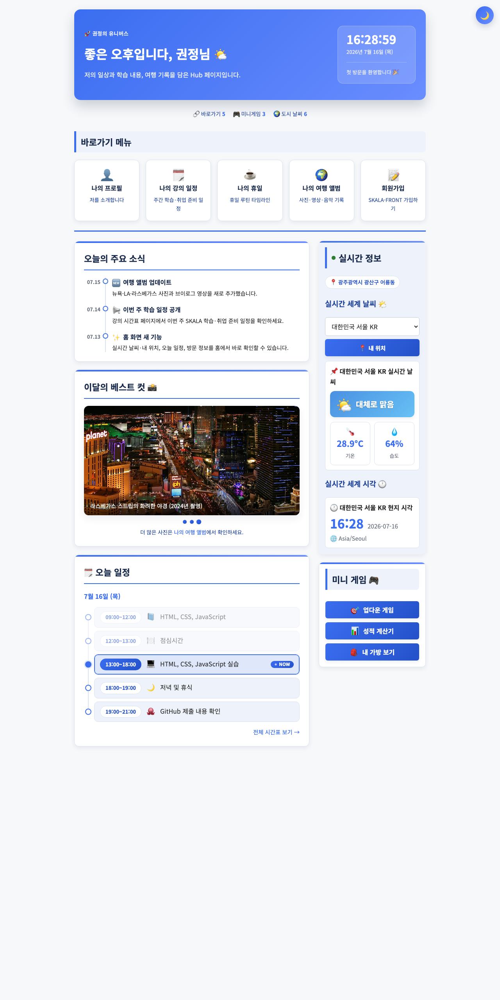
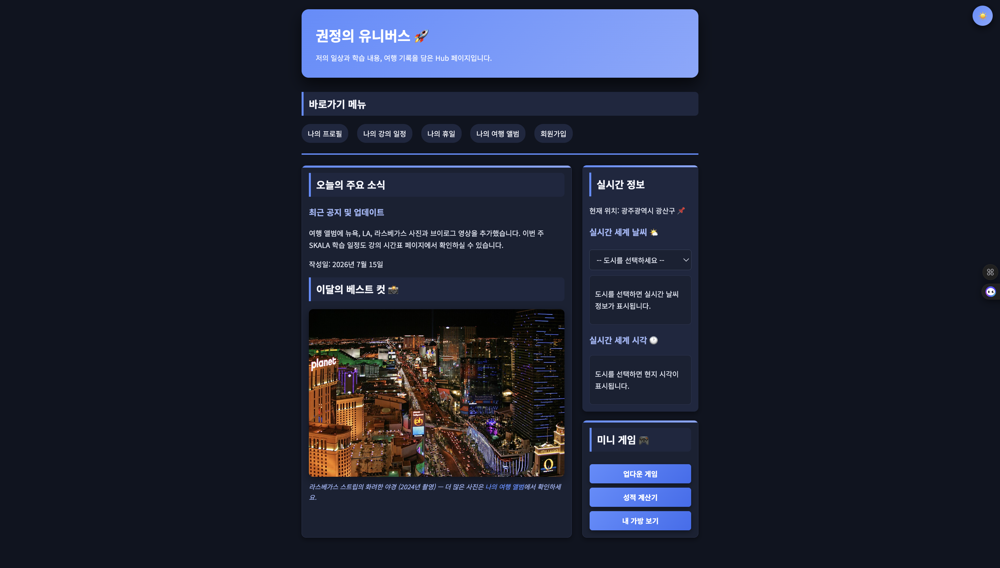
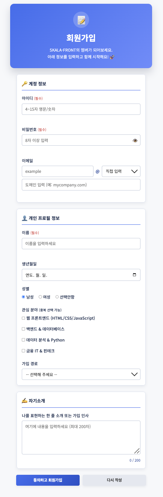
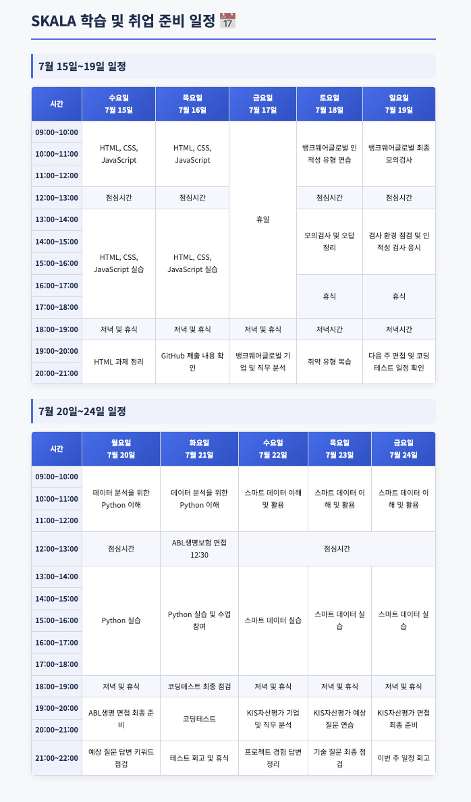

# SKALA-FRONT

SKALA Full-Stack Engineering 과정의 **HTML / CSS / JavaScript** 종합 실습 프로젝트입니다.
개인 포털(Hub) 사이트를 만들며 웹 프론트엔드의 기초부터 심화까지(시맨틱 마크업, 반응형 CSS, 비동기 통신, ES 모듈)를 단계별로 구현했습니다.

## 📸 미리보기

| 메인 (라이트) | 메인 (다크) |
| --- | --- |
|  |  |

| 회원가입 폼 | 강의 일정표 |
| --- | --- |
|  |  |

## ✨ 주요 기능

- **개인 포털 메인(index.html)** — 시맨틱 태그(`header`/`nav`/`main`/`aside`) 기반 허브 페이지
- **다크모드 토글** — `localStorage`에 설정을 저장해 페이지를 이동해도 테마 유지
- **실시간 세계 날씨 & 시각** — [Open-Meteo API](https://open-meteo.com/)를 `fetch` + `async/await`로 호출, 선택한 도시의 현재 기온·습도와 현지 시각 표시
- **미니 게임 3종** — 업다운 숫자 맞추기, 성적 계산기, 내 가방 보기
- **회원가입 폼** — 실시간 유효성 검사(아이디/비밀번호/이름/이메일), 이메일 도메인 직접 입력 지원
- **반응형 디자인** — 786px 이하에서 레이아웃이 세로 1열로 전환
- **애니메이션 / 트랜지션** — 헤더 페이드인, 카드 hover, 버튼 그라데이션 효과

## 📄 페이지 구성

| 파일 | 설명 |
| --- | --- |
| `html/index.html` | 메인 포털 (소개, 바로가기, 실시간 정보, 미니 게임, 베스트 컷) |
| `html/myProfile.html` | 자기소개 (좋아하는 음식·올해 할 일·나를 설명하는 단어) |
| `html/myHoliday.html` | 휴일 루틴 소개 |
| `html/myClass.html` | 학습·취업 준비 주간 일정표 (rowspan/colspan 활용) |
| `html/myTrip.html` | 여행 앨범 (오디오·이미지·비디오) |
| `html/signUp.html` | 회원가입 폼 |
| `html/signUpResult.html` | 회원가입 완료 안내 |

## 🛠 기술 스택

- **HTML5** — 시맨틱 마크업, 폼, 멀티미디어(audio/video), 테이블
- **CSS3** — CSS 변수(테마), Flexbox, Grid, 미디어 쿼리, 트랜지션·애니메이션
- **JavaScript (Vanilla)** — DOM 조작, 이벤트, `async/await`, ES 모듈(`import`/`export`)
- **Web API** — Open-Meteo(날씨), `localStorage`(테마 저장)
- **Font** — Noto Sans KR (Google Fonts)

## 📁 폴더 구조

```
skala-front/
├── html/          # 페이지 HTML 파일
├── css/
│   └── style.css  # 전체 스타일시트 (테마 변수 포함)
├── script/        # JavaScript 파일
│   ├── darkMode.js          # 다크모드 토글
│   ├── weatherAPI.js        # 날씨 API 호출 (export)
│   ├── realtimeInfo.js      # 날씨·시각 화면 표시 (import)
│   ├── signUpValidation.js  # 회원가입 유효성 검사
│   ├── upDown.js            # 업다운 게임
│   ├── grade.js             # 성적 계산기
│   └── bag.js               # 내 가방 보기
└── media/         # 이미지·오디오·비디오 리소스
```

## 🚀 실행 방법

이 프로젝트는 **ES 모듈(`import`/`export`)** 을 사용하므로, HTML 파일을 브라우저에서 바로 열면(`file://`) 실시간 날씨 기능이 동작하지 않습니다. 반드시 **로컬 서버**로 실행해야 합니다.

**VS Code Live Server 사용 (권장)**
1. VS Code에서 `Live Server` 확장 프로그램 설치
2. `html/index.html`을 열고 우클릭 → `Open with Live Server`

**또는 Python 내장 서버 사용**
```bash
# 프로젝트 루트에서 실행
python3 -m http.server 5500
# 브라우저에서 http://localhost:5500/html/index.html 접속
```

## 📚 학습 내용 (커리큘럼)

1. Web 개요 & HTML 기초 (문서 구조, 시맨틱 태그, 리스트, 테이블)
2. HTML Form (input, select, textarea, 유효성)
3. HTML 심화 (멀티미디어, 시맨틱 레이아웃, 접근성)
4. CSS 기초 (선택자, 박스 모델, 색상·폰트)
5. CSS 심화 (Flexbox, Grid, 반응형, 애니메이션, CSS 변수)
6. JavaScript 기초 (변수, 타입, 제어문, 함수, 배열·객체)
7. JavaScript 심화 (DOM/이벤트, 비동기, 모듈)

---

> 본 저장소는 SKALA 교육 과정의 학습 결과물입니다.
> 여행 앨범의 이미지는 Wikimedia Commons의 CC BY-SA 라이선스 사진을 사용했으며, 각 이미지에 출처를 표기했습니다.
